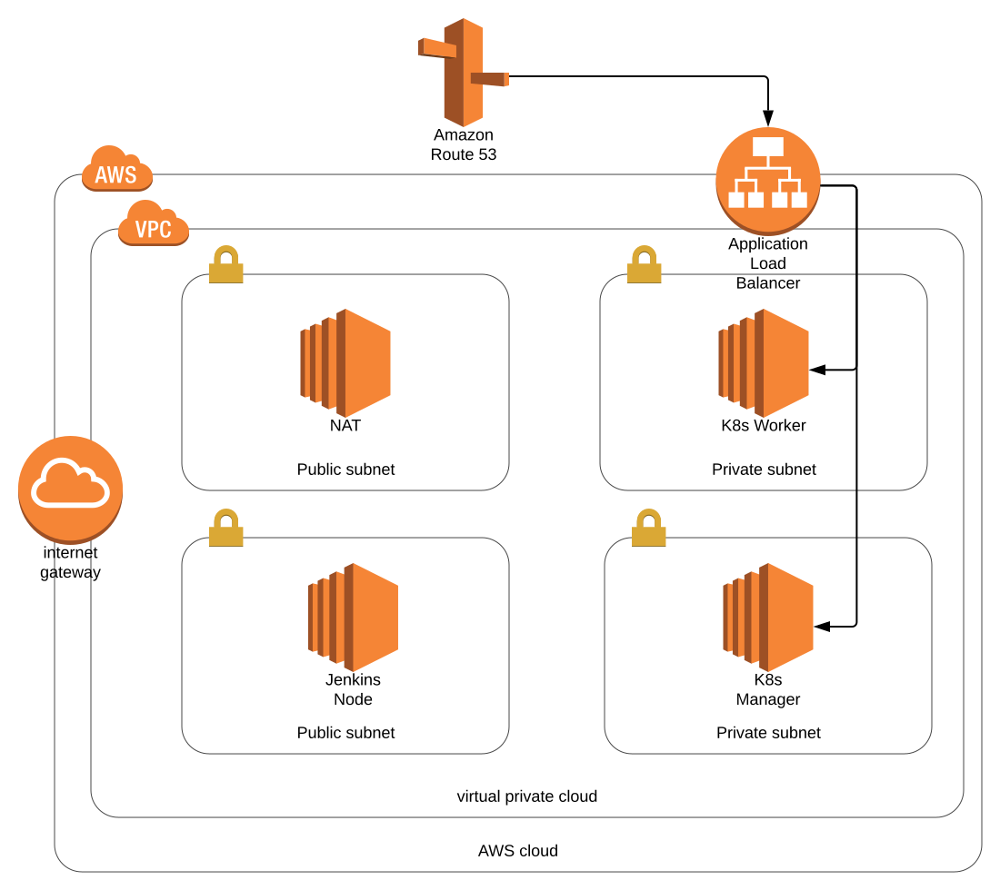

# Capstone project

This repository contains the source code for the capstone project of the [cloud dev ops nanodegree course](https://www.udacity.com/course/cloud-dev-ops-nanodegree--nd9991).

## Directory description

|Name|Content|
|-|-|
|Root direcotyr|Dockerfile, Jenkinsfile|
|ansible|ansbile playbook used to configure the CI/CD environment and the kubernetes cluster|
|app|Demo application to copy inside the docker container|
|bin|Binaries for docker linting|
|cloudformation|yml files used to create the network, jenkins and k8s cluster nodes.
|script|utiliy scripts to launch playbook and cloudformation|

Inside the cloudformation folder there are three yml files, `network.yml` defines the network topology used, the image below shows the infrastructure diagram. `jenkins.yml` defines the EC2 instance used to deploy the jenkins server. `kubernetes_cluster.yml` defines two EC2 instances, the instances are registered in a target group associated to a load balancer. This file is used to deploy the cluster every time a commit is pushed to github.



Ansible folder contains the playbook used to configure the CI/CD environment and the kubernetes stack. The inventories are built dynamically with aws_ec2 plugin.

## CI/CD description

Every time a new commit is pushed this steps are executed:
- Linting of Dockerimage
- Building of docker image
- Vulnerabilites scanning of docker image
- Pushing of docker image
- Deployment of a new kubernetes stack on AWS
- Stack configuration ( download of the docker image from dockerhub)
- Update of the route53 recoder to point to the new load balancer

## Setup CI/CD pipeline

Install ansible locally with this steps:

```
cd scripts/env
./install_ansible <virtual_env_path>
```

`<virtual_env_path>` is the directory where to create the virtual environment with ansible and aws dependencies.

The next step is to deploy the network stack and the jenkins node in AWS. The required steps are:

```
cd cloudformation
../scripts/cloudformation/cloud-formation-helper.sh create <network_stack_name> network.yml
../scripts/cloudformation/cloud-formation-helper.sh create <jenkins_stack_name> jenkins.yml
```

After the jenkins node has been deployed we can configure it.

```
scripts/ansible/configure_jenkins_node.sh <virtual_env_path> <jenkins_private_key_path>
```

Connect to <jenkins_node_ip>:8080 and use the initial password to login. The initial password is saved in `~/jenkins_initial_password/initialAdminPassword` on the local machine. Install the suggested plugins plus BlueOcean, Docker, Aqua microscanner and 'Pipeline: AWS Steps'. Set up the repository and add the docker hub credential with id `docker-credential`, set up the microscanner token.